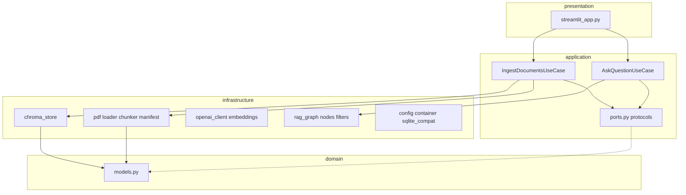
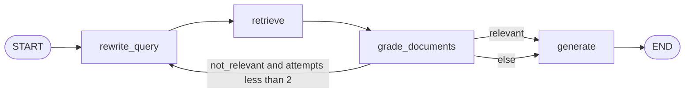

# AI Advocate — full project guide for learning

This document explains the **architecture**, **important code paths**, and **concepts** you need to understand a production-style **agentic RAG** system over legal PDFs. Read it alongside the repo: open the cited files in your editor as you go.

---

## What this project is

**AI Advocate** is a learning codebase that:

- Ingests Indian statute PDFs from `data/` (manifest-driven).
- Splits them into **chunks** with **section-aware prefixes** (critical for long acts like Income Tax Act, 2025).
- Stores **dense vector embeddings** in **ChromaDB** for similarity search.
- Answers questions through a **LangGraph** workflow: not a single “retrieve then generate” call, but a **small state machine** with **query rewrite**, **metadata-filtered retrieval**, **relevance grading**, and optional **retry loops**.

The UI is Streamlit; the “brain” is the graph + OpenAI models.

---

## Core concepts: RAG and agentic RAG

### Retrieval-Augmented Generation (RAG)

1. **Offline:** Turn documents into **chunks** → **embed** each chunk → store vectors + metadata in a **vector database**.
2. **Online:** **Embed the user question** → **find nearest chunks** (similarity search) → pass those chunks as **context** to an LLM → **generate** an answer grounded in that context.

**Why RAG:** The model’s weights do not contain your private PDFs. You ground answers in **retrieved evidence**, which reduces pure hallucination (if you enforce “answer only from context”).

### Naive RAG vs agentic RAG

| Idea | Naive RAG | Agentic RAG (this project) |
|------|-----------|----------------------------|
| Query to index | Same words the user typed | **Rewrite** for better lexical/semantic match |
| Retrieval | Fixed `k` neighbors | Same, but often **after** routing metadata |
| Quality control | Hope the top-k are relevant | **LLM grades** whether chunks help the question |
| On failure | One shot | **Loop:** rewrite again (limited attempts) then still answer or refuse |
| Routing | Manual or none | **Predict domain** (Finance / Land / All) and **temporal scope** (current vs legacy tax) |

**Agentic** here means: **multiple LLM steps** and **conditional control flow** (graph), not a single prompt. It costs more latency and tokens but improves robustness when queries are vague or retrieval is noisy.

---

## Clean architecture

The code follows **dependency direction**: outer layers depend inward; the **domain** never imports Streamlit or Chroma.

| Layer | Role | Key files |
|-------|------|-----------|
| **Domain** | Pure types: documents, chunks, citations, routing DTOs | [`src/ai_advocate/domain/models.py`](../src/ai_advocate/domain/models.py) |
| **Application** | Use cases + **ports** (interfaces): what the app needs, not how | [`src/ai_advocate/application/ports.py`](../src/ai_advocate/application/ports.py), [`ask_question.py`](../src/ai_advocate/application/use_cases/ask_question.py), [`ingest_documents.py`](../src/ai_advocate/application/use_cases/ingest_documents.py) |
| **Infrastructure** | Adapters: PDF, Chroma, OpenAI, LangGraph, settings | [`src/ai_advocate/infrastructure/`](../src/ai_advocate/infrastructure/) |
| **Presentation** | Streamlit only | [`src/ai_advocate/presentation/streamlit_app.py`](../src/ai_advocate/presentation/streamlit_app.py) |
| **Composition root** | Wires everything | [`src/ai_advocate/infrastructure/container.py`](../src/ai_advocate/infrastructure/container.py) |

**Learning point:** If you swap Chroma for another vector DB, you change **infrastructure** and keep **use cases** stable as long as you honor the port contracts.

---

## Pipeline 1: Ingestion (offline)

**Entry:** `uv run ai-advocate-ingest` → [`src/ai_advocate/cli/ingest.py`](../src/ai_advocate/cli/ingest.py) → [`IngestDocumentsUseCase`](../src/ai_advocate/application/use_cases/ingest_documents.py).

**Steps:**

1. **Manifest** — [`load_manifest_yaml`](../src/ai_advocate/infrastructure/pdf/manifest.py) reads [`data/manifest.yaml`](../data/manifest.yaml). Each row defines `file`, `act_title`, `domain`, `act_version`, optional `effective_date` / `supersedes`. Paths under `file` are relative to `DATA_DIR` (default `data/`).
2. **PDF text** — [`load_pdf_pages`](../src/ai_advocate/infrastructure/pdf/loader.py) uses pdfplumber per page.
3. **Chunking** — [`chunk_document`](../src/ai_advocate/infrastructure/pdf/chunker.py) builds one string blob with page markers, finds `Section N` headers via regex, and for each section:
   - Builds **prefixed** text: `[S{n}] {title}\n---\n{body}` so every stored chunk carries **section identity** (important for mega-sections like TDS consolidation in IT Act 2025).
   - If a section body exceeds `_CHAR_SOFT_LIMIT`, it **sub-splits** with overlap but **repeats the same prefix** on each sub-chunk.
4. **Embeddings** — [`OpenAIEmbedderAdapter.embed`](../src/ai_advocate/infrastructure/llm/embeddings.py) calls OpenAI in **batches** (`EMBEDDING_BATCH_SIZE`, default 100) because the API enforces a **max tokens per embedding request**.
5. **Vector store** — [`ChromaVectorStore.upsert_chunks`](../src/ai_advocate/infrastructure/vector_store/chroma_store.py) stores vectors + string metadata (`domain`, `act_version`, `section_label`, pages, paths, etc.).

**Concepts:** **chunking strategy** directly affects retrieval quality; **metadata** enables **filtered retrieval** at query time (domain, act version).

---

## Pipeline 2: Question answering (online, agentic RAG)

**Entry:** Streamlit → [`AskQuestionUseCase.run`](../src/ai_advocate/application/use_cases/ask_question.py).

The use case builds **initial graph state** (question, optional domain override, `reference_date` as ISO string, `retrieval_attempts: 0`) and calls `graph.invoke(...)`. The compiled graph lives in [`build_rag_graph`](../src/ai_advocate/infrastructure/graph/rag_graph.py).

### Graph topology

### LangGraph mechanics (what to remember)

- **State** — A typed dictionary [`RAGGraphState`](../src/ai_advocate/infrastructure/graph/state.py) holds the conversation “variables” passed between nodes (question, rewritten query, predicted domain, temporal scope, retrieved `documents`, `grade`, `retrieval_attempts`, final `generation`, `citations`, …).
- **Nodes** — Pure functions that take state + dependencies and **return partial updates** (dict merges into state).
- **Edges** — Linear or **conditional** (`route_after_grade`): this is where “agentic” branching lives.

### Node-by-node (concepts + code)

**1. `rewrite_query`** — [`nodes.py`](../src/ai_advocate/infrastructure/graph/nodes.py)

- Calls the LLM with **JSON mode** to produce a [`RewriteResult`](../src/ai_advocate/domain/models.py): `rewritten_question`, `predicted_domain` (Finance | Land | All), `temporal_scope` (current | legacy | unspecified), `reasoning`.
- **Concept:** **Query rewriting** aligns user language with statute language and sets **routing signals** without a separate classifier model.

**2. `retrieve`**

- Builds a Chroma `where` clause via [`build_chroma_where`](../src/ai_advocate/infrastructure/graph/filters.py): domain filter from UI override or predicted domain; for `temporal_scope == "legacy"` restricts to `act_version == IT_1961`; for `"current"` excludes `IT_1961`.
- Embeds **`rewritten_question`** (not only the raw question) and runs similarity search with `k` (default 6).
- **Concept:** **Pre-retrieval filtering** shrinks the search space (less cross-domain noise). This is **not** full re-ranking; it’s **hard metadata gating**.

**3. `grade_documents`**

- LLM sees the user question + rewritten query + truncated excerpt list; returns JSON `{"relevant": true|false}`.
- Increments `retrieval_attempts` when not relevant or when there are zero docs.
- **Concept:** **Relevance grading** is a cheap second opinion before generation. It reduces answering from irrelevant chunks.

**4. `route_after_grade`**

- If relevant → `generate`.
- If not relevant and `retrieval_attempts < 2` → loop to `rewrite` (another rewrite/retrieve cycle).
- Otherwise → `generate` anyway (often to **refuse** or give best-effort with weak context).

**5. `generate`**

- If `temporal_scope == "legacy"` and no documents: **refuse** with instructions to add IT_1961 (avoids silently using IT_2025).
- If no documents: refuse / ask to rephrase.
- Else: builds a context block from chunk dicts with act, version, pages, section; LLM answers with **grounding instructions** and citations; returns structured `Citation` list.
- **Concept:** **Grounded generation** + explicit **refusal paths** are essential in legal-assist UX (still not legal advice).

---

## Important supporting code (production gotchas)

### ChromaDB and SQLite FTS5

Chroma’s embedded DB uses SQLite migrations that create **FTS5** full-text tables. Some Python builds (e.g. uv’s CPython on macOS) ship `sqlite3` **without** FTS5.

[`ensure_sqlite_fts5`](../src/ai_advocate/infrastructure/sqlite_compat.py) runs **before** `import chromadb` in [`chroma_store.py`](../src/ai_advocate/infrastructure/vector_store/chroma_store.py) and swaps in `pysqlite3` when needed.

### `MANIFEST_PATH` and empty `.env` values

An empty `MANIFEST_PATH=` can be parsed as a path equivalent to `.` (current directory), which is a **directory**, not a file. [`Settings`](../src/ai_advocate/infrastructure/config.py) uses validators so empty / `.` means “use `DATA_DIR/manifest.yaml`”.

### Embedding API token limits

Sending all chunk texts in **one** `embed_documents` call can exceed OpenAI’s **per-request token cap**. Batching in [`OpenAIEmbedderAdapter`](../src/ai_advocate/infrastructure/llm/embeddings.py) fixes that; tune `EMBEDDING_BATCH_SIZE` if you hit limits with very long chunks.

---

## Configuration surface (mental model)

| Variable | Purpose |
|----------|---------|
| `OPENAI_API_KEY` | Required for ingest and chat |
| `DATA_DIR` | Root for PDFs + default manifest path |
| `MANIFEST_PATH` | Optional override; leave empty for `DATA_DIR/manifest.yaml` |
| `CHROMA_PERSIST_DIR` | On-disk Chroma database |
| `CHROMA_COLLECTION` | Collection name (default `legal_statutes`) |
| `OPENAI_CHAT_MODEL` / `OPENAI_EMBEDDING_MODEL` | Model ids |
| `REFERENCE_DATE` | Injected into rewrite for “this year” disambiguation |
| `EMBEDDING_BATCH_SIZE` | Chunks per embedding API call |

See [`.env.example`](../.env.example).

---

## How to read the codebase (suggested order)

1. [`domain/models.py`](../src/ai_advocate/domain/models.py) — vocabulary of the system.
2. [`application/use_cases/ingest_documents.py`](../src/ai_advocate/application/use_cases/ingest_documents.py) — offline pipeline in one screen.
3. [`infrastructure/pdf/chunker.py`](../src/ai_advocate/infrastructure/pdf/chunker.py) — section detection and prefix discipline.
4. [`infrastructure/graph/rag_graph.py`](../src/ai_advocate/infrastructure/graph/rag_graph.py) + [`nodes.py`](../src/ai_advocate/infrastructure/graph/nodes.py) + [`filters.py`](../src/ai_advocate/infrastructure/graph/filters.py) — agentic RAG core.
5. [`application/use_cases/ask_question.py`](../src/ai_advocate/application/use_cases/ask_question.py) — graph invoke and `Answer` mapping.
6. [`presentation/streamlit_app.py`](../src/ai_advocate/presentation/streamlit_app.py) — UI and composition usage.

---

## Exercises

1. Add a new PDF and a new `documents` entry in `data/manifest.yaml`; re-ingest and verify retrieval filters (`act_version`, `domain`).
2. Lower `EMBEDDING_BATCH_SIZE` to 20 and observe ingest still completes (more round trips).
3. Temporarily remove `grade_documents` from the graph (naive RAG) and compare answer quality on ambiguous queries.
4. Add a tiny **golden set** (10 questions + expected act or section keywords) and manually score retrieval hits.
5. Extend routing: add a third domain in the manifest and thread it through `RewriteResult` and `build_chroma_where`.

---

## Disclaimer

This software assists **research-style** reading of statutes in the corpus. It does **not** provide legal advice. Always verify against authoritative sources and qualified professionals.
